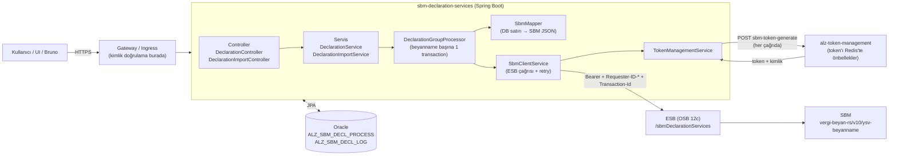
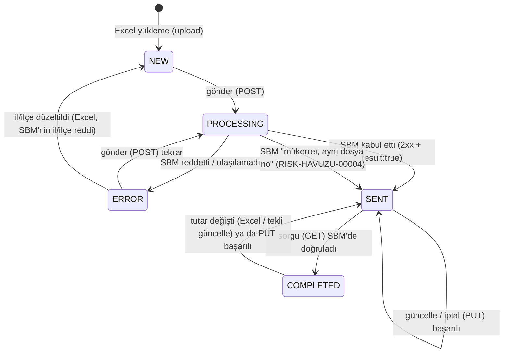
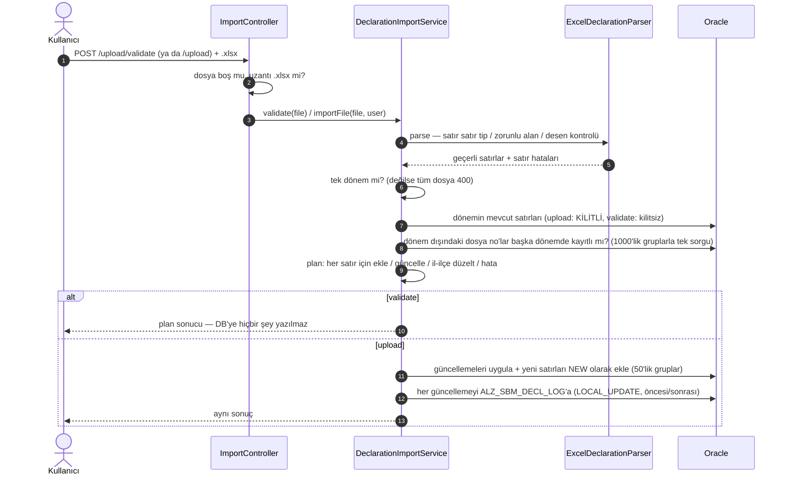
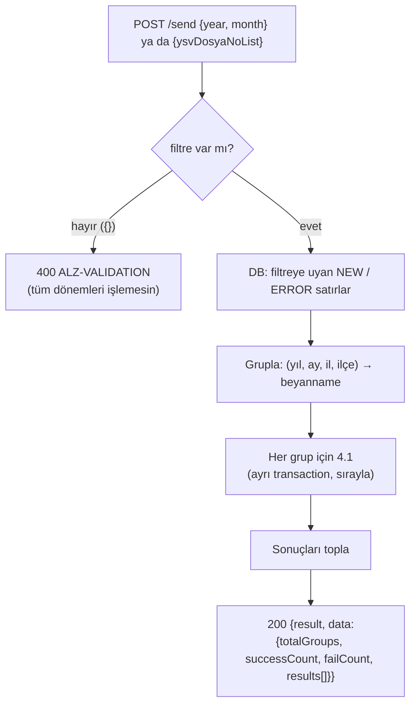
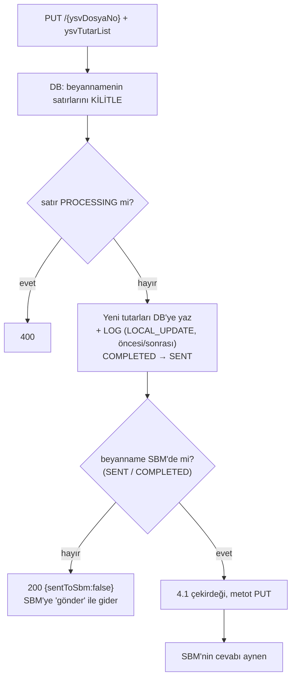
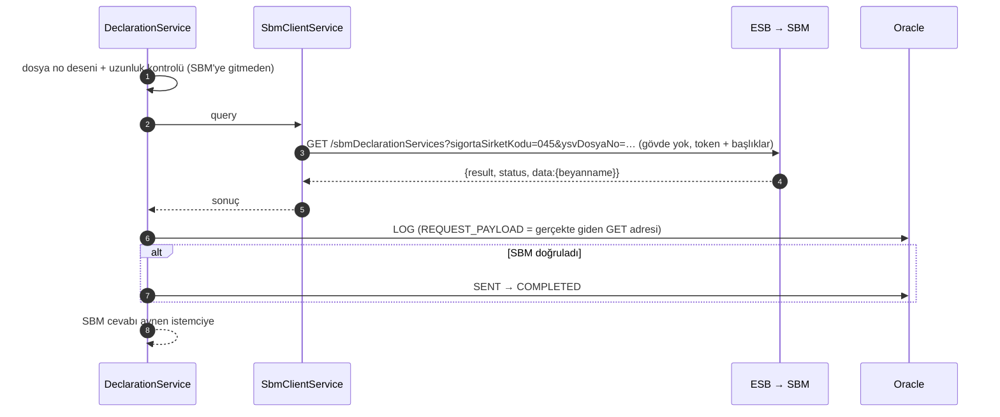

# Sistem Nasıl Çalışır — sbm-declaration-services

Bu doküman bir uç (endpoint) tetiklendiğinde **arka planda sırayla ne olduğunu** anlatır. Her
bölümde önce şema, sonra maddeler var. Son bölüm, Bruno koleksiyonundaki her isteği bu akışlara
bağlar.

> Şemalar mermaid formatındadır. GitHub, IntelliJ (Mermaid eklentisi) ve VS Code'da çizim olarak
> görünür.

---

## 1. Büyük resim



- **Tek bilgi kaynağı DB'dir.** Excel önce DB'ye yazılır; SBM'ye her zaman DB'deki değerler gider.
- **Beyanname = aynı `ysvDosyaNo`'nun satırları** (en fazla 2: MENKUL + GAYRIMENKUL). SBM'ye tek
  istekte `ysvTutarList` içinde gider.
- **Yuva = il + ilçe + yıl + ay.** SBM her yuvada tek beyanname kabul eder (`RISK-HAVUZU-00004`) ve
  yuvayı ilk gönderilen dosya no'ya kalıcı olarak bağlar. SBM'de silme yoktur.
- **Token her SBM çağrısında yeniden istenir**; önbellek token servisindedir (SBM dokümanının "her
  istek için ayrı token alınmamalı" kuralı orada karşılanır).

---

## 2. Satırın yaşam döngüsü (`STATUS`)



| Durum | Anlamı | Hangi işlemler seçer |
|---|---|---|
| `NEW` | Yüklendi, SBM'ye hiç gitmedi | gönder |
| `PROCESSING` | O an SBM çağrısı sürüyor (transaction içinde) | hiçbiri; Excel bu satırı güncelleyemez |
| `SENT` | SBM kabul etti | güncelle, iptal, sorgu |
| `COMPLETED` | SBM'den okunup doğrulandı | güncelle, iptal, sorgu |
| `ERROR` | SBM reddetti ya da ulaşılamadı; sebep `ERROR_DETAILS`'te | gönder (tekrar) |

- Başarısız **PUT** satırı `ERROR` yapmaz, **önceki durumunda** bırakır. `ERROR` olsaydı sonraki
  "gönder" onu tekrar POST eder, SBM'de mükerrer beyanname riski doğardı.

---

## 3. Excel: kontrol et (`/upload/validate`) ve yükle (`/upload`)



**Satır bazında karar (upsert, anahtar `ysvDosyaNo + menkulTipi`):**

| Durum | Sonuç |
|---|---|
| DB'de yok | `NEW` olarak **eklenir** |
| DB'de var, tutar / tarih farklı | **Güncellenir**; `COMPLETED` → `SENT`; `updatedFileNos`'a girer → SBM'ye `PUT /update` ile taşınır |
| DB'de var, değerler aynı | Dokunulmaz |
| İl/ilçe farklı, beyanname SBM'ye hiç ulaşmamış (`NEW` ya da `RISK-HAVUZU-00006..00009` ile `ERROR`), tüm menkul satırları aynı yeni il/ilçeyle dosyada, yeni yuva boş | **İl/ilçe düzeltilir**, satır `NEW` olur |
| İl/ilçe farklı, diğer durumlar | Satır hatası (`ALZ-EXCEL-CONFLICT`) |
| Yuvada başka dosya no var (DB'de ya da dosyada) | Satır hatası |
| Dosya no başka dönemde kayıtlı | Satır hatası |
| Satır o an `PROCESSING` | Satır hatası (`ALZ-EXCEL-BUSY`) |
| Dosyada aynı anahtar iki kez | Satır hatası (`ALZ-EXCEL-DUPLICATE`) |

- **Satır hatası dosyanın geri kalanını engellemez.** DB kısıtı ihlali ise tüm dosyayı geri alır (500).
- `validate` ve `upload` **aynı `plan` kodunu** çalıştırır; sonuçları farklı çıkamaz.
- Dosya diske yazılmaz; adı yalnız `SOURCE_FILE_NAME` kolonuna kaydedilir.

---

## 4. Gönder (POST) — tekli `/{ysvDosyaNo}/send` ve toplu `/send`

### 4.1 Bir beyannamenin gönderimi (tekli ve toplu ortak çekirdek)

```mermaid
sequenceDiagram
    autonumber
    participant G as DeclarationGroupProcessor
    participant DB as Oracle
    participant M as SbmMapper
    participant SC as SbmClientService
    participant T as TokenManagementService
    participant TOK as alz-token-management
    participant ESB as ESB → SBM

    Note over G,DB: TEK TRANSACTION (beyanname başına)
    G->>DB: satırları KİLİTLE (başka istek aynı anda dokunamaz)
    G->>G: durum uygun mu? (POST: NEW/ERROR) — değilse 409
    G->>DB: STATUS = PROCESSING
    G->>M: satırlar → SBM JSON (menkul 1/2 → "MENKUL"/"GAYRIMENKUL"; büyükşehirde ilceKodu YOK)
    G->>SC: send(request)
    SC->>SC: Transaction-Id = yeni UUID (retry'da aynı kalır)
    SC->>T: token iste
    T->>TOK: POST sbm-token-generate {clientName, transactionId, companyCode, [kimlik]}
    TOK-->>T: accessToken + clientCredentials(tip, no)
    SC->>ESB: POST + Authorization: Bearer, Requester-ID-Type/No, Transaction-Id
    ESB-->>SC: {result, status, data | error}
    alt 5xx ya da SEC-00002
        SC->>ESB: 1 kez tekrar (yeni token, aynı Transaction-Id)
    end
    SC-->>G: sonuç
    G->>DB: ALZ_SBM_DECL_LOG (ayrı transaction — log hatası işlemi bozmaz)
    alt başarılı
        G->>DB: STATUS = SENT, DATE_SENT
    else RISK-HAVUZU-00004 ve mesajdaki dosya no bizimki
        G->>DB: STATUS = SENT (zaten SBM'de)
    else diğer hata
        G->>DB: STATUS = ERROR, ERROR_DETAILS = SBM kodları
    end
```

**POST gövdesi (örnek — İstanbul, büyükşehir):**

```json
{ "ay": 1, "ilKodu": 34, "sigortaSirketKodu": "045", "sonOdemeTarihi": "2025-02-20", "yil": 2025,
  "ysvDosyaNo": "TESTDEV2501-01",
  "ysvTutarList": [
    { "menkulTipi": "MENKUL", "alinanPrimTutari": 700000.00, "iptalPrimTutari": 15000.00,
      "odenecekVergi": 68500.00, "vergiOrani": 10, "vergiPrimTutari": 685000.00 },
    { "menkulTipi": "GAYRIMENKUL", "...": "..." } ] }
```

- Sayısal alanlar tırnaksız (SBM alan tipi tablosu). `ilceKodu` büyükşehirde **hiç yoktur**.
- `sigortaSirketKodu` her zaman `045` (Excel'deki OPUS kodu kullanılmaz).

### 4.2 Toplu gönderim



- Toplu işlem **bilerek transaction'sız**: 100. beyannamedeki hata ilk 99'unu geri almaz; SBM'nin
  kabul ettikleri DB'de de `SENT` kalır.
- `result` yalnız **hiç hata yoksa** `true`; her beyannamenin SBM cevabı `results[]` içindedir.
- İstemci zaman aşımına düşse bile sunucu işi bitirir. Aynı çağrı iki kez tetiklenirse ikincisi
  gönderilmişleri 409 ile atlar (satır kilidi + durum kontrolü).
- Süre: beyanname başına ≈0,4 sn (token + ESB + SBM); 298 beyanname ≈2 dk.

---

## 5. Güncelle (PUT)

### 5.1 Tekli `PUT /{ysvDosyaNo}` (gövdede yeni tutarlar)



- PUT gövdesinde `ay`, `yil`, `ilKodu`, `ilceKodu` **gönderilmez** (SBM PUT'ta kabul etmez).
- `vergiPrimTutari` / `odenecekVergi` negatif olabilir; `alinanPrimTutari` / `iptalPrimTutari` olamaz.
- SBM reddederse DB yeni değerlerde kalır; istek tekrar atılabilir.

### 5.2 Toplu `PUT /update`

- DB'de **zaten güncellenmiş** değerleri SBM'ye taşır; gövdede tutar yoktur, yalnız filtre.
- Tipik kullanım: Excel yükle → cevaptaki `updatedFileNos` → `PUT /update {"ysvDosyaNoList":[…]}`.
- Yalnız `SENT` / `COMPLETED` satırlar seçilir.

---

## 6. İptal — `/{ysvDosyaNo}/cancel` ve toplu `/cancel`

- SBM'de silme yoktur: 5.2 ile aynı akış, **tüm tutarlar 0** olarak PUT edilir.
- SBM kabul ederse DB'deki tutarlar da 0 olur; kabul etmezse DB'ye dokunulmaz.
- Yuva bu dosya no'da kalır. Geri getirmek için: Excel'i tekrar yükle → `PUT /update`.

---

## 7. Sorgula (GET) — tekli `GET /{ysvDosyaNo}` ve toplu `POST /query`



- Toplu sorgu (`POST /query`) filtreye uyan `SENT` / `COMPLETED` beyannameleri tek tek sorgular.
  POST olmasının sebebi gövdedeki 1000'e kadar dosya no listesi ve satır durumunu değiştirmesi.
- Tekli sorgu DB'de olmayan bir dosya no için de SBM'ye gider (SBM'de var mı diye bakmak için).

---

## 8. Listele — `GET /processes`

- Yalnız DB okur; SBM'ye gitmez. Filtre: `status`, `year`, `month`, `cityCode`; sayfalama `page`,
  `size`; sıralama `sort` yalnız izinli alanlarla (yoksa 400).

---

## 9. Başlıklar, kimlik ve izlenebilirlik

| İstek başlığı | Nereye gider |
|---|---|
| `X-User-Name` | DB'deki `CREATED_BY_USER` / `UPDATED_BY_USER` / `SENT_BY_USER`; yoksa `SYSTEM` |
| `X-Requester-Id-Type` + `X-Requester-Id-No` | Token isteğine `clientIdentityType/No`; token servisi aynen döner → SBM'ye `Requester-ID-Type/No` |
| (kimlik başlıkları yok) | Token servisi şirket VKN'sini döner — SBM dokümanı §5.1: toplu işlemde kurum VKN'si |

- **Transaction-Id:** her SBM çağrısı için tek UUID; token isteği, uygulama logu,
  `ALZ_SBM_DECL_LOG.LOG_MESSAGE` ve SBM aynı numarayı taşır. SBM destek talebinde istenir.
- Loglarda token ve TCKN/YKN maskelidir (VKN kişisel veri olmadığı için açık).

---

## 10. Cevap biçimi ve hata kodları

- Tekli uçlar **SBM'nin cevabını aynen ve SBM'nin HTTP koduyla** döner (POST 201, red 422…).
- Toplu uçlar 200 ve `data.results[]` içinde beyanname başına SBM cevabı.
- SBM yerine ESB'den HTML / bağlantı hatası gelirse 502 `CORE-00000`; HTML istemciye verilmez.

| HTTP | Kod | Ne zaman | SBM'ye gitti mi? |
|---|---|---|---|
| 400 | `ALZ-VALIDATION` | Alan / başlık / filtre / desen / sort | Hayır |
| 400/405/413/415 | `ALZ-REQUEST` | Bozuk JSON, yanlış metot, içerik tipi, dosya boyutu | Hayır |
| 404 | `ALZ-NOT-FOUND` | Dosya no DB'de yok | Hayır |
| 409 | `ALZ-STATUS-CONFLICT` | Durum işleme uygun değil (ör. zaten gönderilmiş) | Hayır |
| 422 | SBM kodu | SBM reddetti ya da SBM kuralına aykırı (ör. 36 karakter) | Duruma göre |
| 502 | `CORE-00000` | ESB / SBM'ye ulaşılamadı | Denendi |
| 503 | `SEC-00001` | Token alınamadı | Hayır |
| 500 | `ALZ-INTERNAL` | Beklenmeyen hata — ayrıntı yalnız logda | — |

---

## 11. Bruno koleksiyonu → akış eşlemesi (`Lokal Test/bruno-lokal-test-2025-01.json`)

| İstek | Uç | Bölüm | DB'ye etkisi | SBM çağrısı |
|---|---|---|---|---|
| 0.1 / 0.2 | `actuator/health`, `actuator/prometheus` | — | — | — |
| 1.1 | `POST /upload/validate` | §3 | yok (yalnız okur) | yok |
| 1.2 | `POST /upload` | §3 | 12 satır `NEW` | yok |
| 1.3 | `POST /upload` (aynı dosya) | §3 | yok (değer aynı) | yok |
| 2.x | `GET /processes` | §8 | yok | yok |
| 3.1 / 3.2 | `POST /{no}/send` | §4.1 | `NEW` → `SENT` | POST |
| 3.3 | `POST /send {yil, ay}` | §4.2 | kalan 4 beyanname `SENT` | 4 × POST |
| 4.1 / 4.2 | `GET /{no}` | §7 | `SENT` → `COMPLETED` | GET |
| 4.3 | `POST /query {yil, ay}` | §7 | hepsi `COMPLETED` | 6 × GET |
| 5.1 | `POST /upload/validate` (güncelleme) | §3 | yok | yok |
| 5.2 | `POST /upload` (güncelleme) | §3 | 3 satır güncellenir (`→ SENT`), `-07` `NEW` | yok |
| 5.3 | `PUT /update {liste}` | §5.2 | `SENT` | 2 × PUT |
| 5.4 | `POST /TESTDEV2501-07/send` | §4.1 | `NEW` → `SENT` | POST |
| 5.5 | `PUT /TESTDEV2501-04` | §5.1 | tutarlar + `SENT` | PUT |
| 6.1 | `POST /TESTDEV2501-06/cancel` | §6 | tutarlar 0 | PUT (0) |
| 6.2 / 6.3 | `POST /upload` + `PUT /update` | §3, §5.2 | tutarlar Excel'e döner | 2 × PUT |
| 7.1 – 7.7 | beklenen hatalar | §10 | yok | yok |
